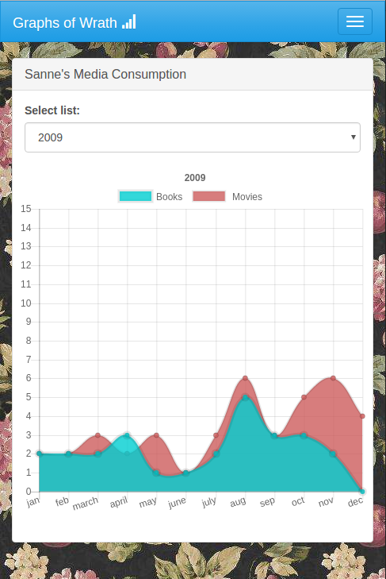
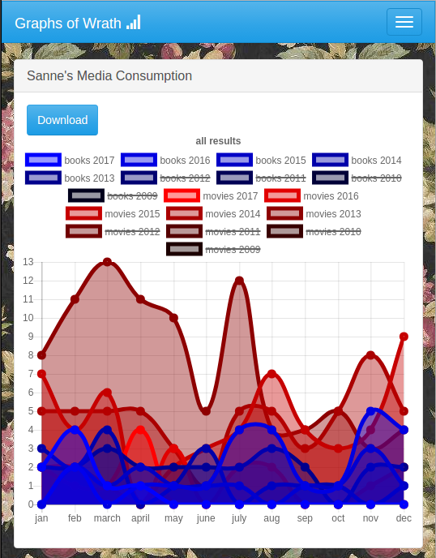
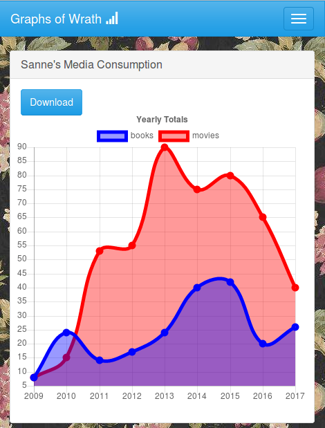
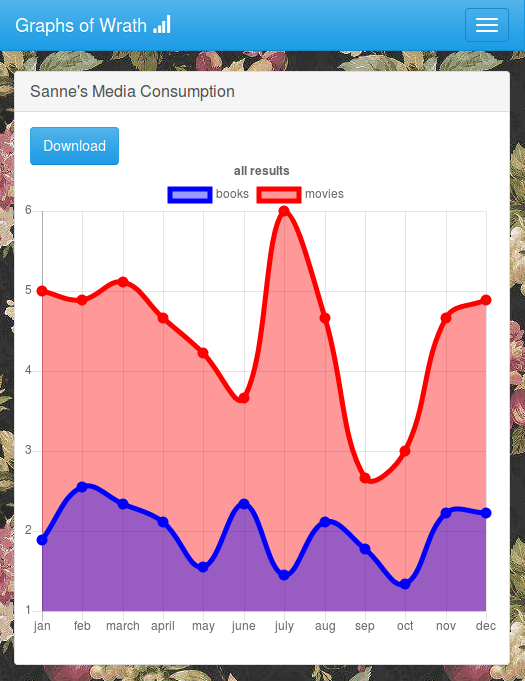

# GraphsOfWrath

Hobby project involving graphs, scraped/crawled from a Listography.com page where my 
girlfriend tracks her book reading and movie viewing.

### Single Year movies/books



### Multi-year movies/graphs



### Yearly totals



### Monthly averages



History
===
It used to generate .png files with "amenadiel/jpgraph" 3.6.8, but i am now 
reworking it to generate ChartJS images on a HTML5 canvas, because it's more 
awesome. Much of this retooling is *still ongoing*.

I originally wrote it CakePHP as as skill-level demo and POC in 2013, and 
started rewriting it recently to keep my Symfony skills alive, as i started 
learning Symfony in 2.3 while 3 is out now and 4 is on the horizon.

Accordingly i took the old-fashioned approach and made a Bundle for my separate 
set of functionalities, apparently you're supposed to use just the AppBundle in 
SF3 but i'll skip that habit as SF4 won' t even have an AppBundle.

Original Comments were in Dutch, i will be rewriting this as i refactor the 
attached code.

I'm also trying to set up Codeception so i can have one system for all my tests.
Please don' t mind the mess ... ;)

INSTALL
---
I will assume the people reviewing this will know enough about php & frameworks to install a SF3 project.

* Either set up your VHOST manually or use ```bin/console server:run``` (this documentation will assume the latter)
* Run composer update
* ```bin/console doctrine:schema:create```
* Create directory ```web/img/sanne/``` (and give it 775 permission)
* Browse to http://127.0.0.1:8000/generate


TODO 
---

(Yes i could use GitHub tickets, but i don't actually expects pull requests)

* Feature: make inherited templates out of all the shared parts of current graph templates
* Feature: make more re-usable version of the current update*.js files
* Testing: Behat Tests 
* Feature: "Generate" page should have a loading status/spinner
* Feature: FOSUser account to protect generate and truncate buttons
* Feature: Admin panel for generate & truncate

PHP Modules required (beyond SF3 requirements)
---

* curl
* mbstring
* ext-gd 